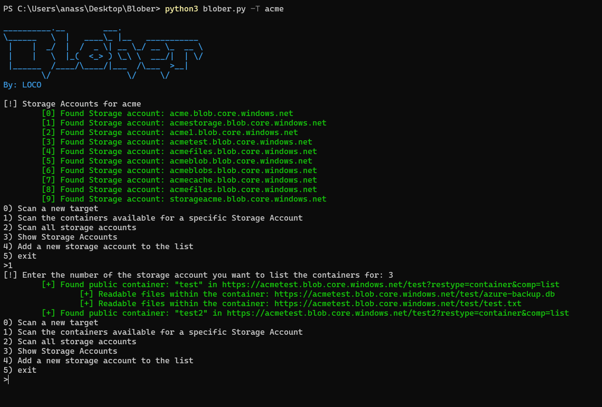
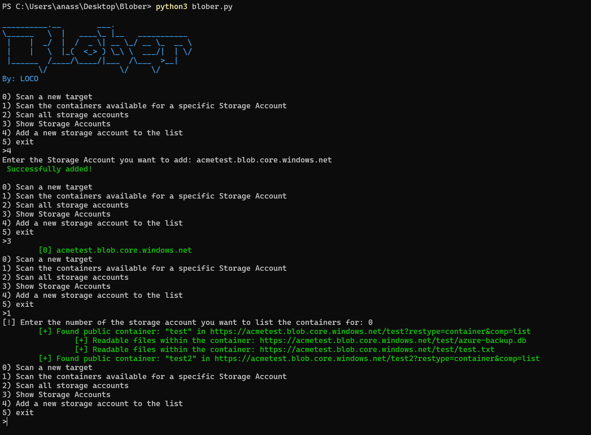

# Blober

## Description
A relatively fast and easy to use blob hunter.

## Usage

`blober.py [-h] [-T Target] -W [Wordlist]`

Target is the target you are willing to test.

wordlist has the words to be permutated with the Company Name, which are used to obtain the storage account name.

## Examples

Running a new scan with arguemnt:

Running a new scan from the menu:

Adding a pre-known storage account then scanning it:

## Disclaimer

Bigger wordlist means more time to run, I added some well-known words to the list, in case you want better accuracy you will need to add more words to containers.txt and Permutations.txt